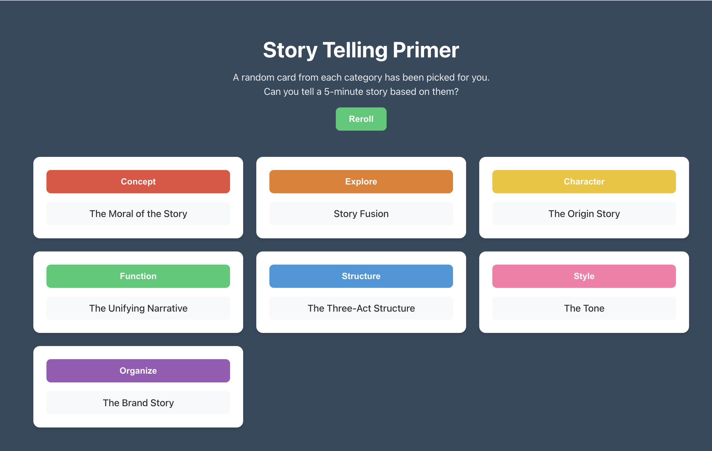

# Storytelling Tactics

An app for exploring the Storyteller Tactics deck and a companion GitHub Pages site for an interactive report.

## What is Storyteller Tactics

Storyteller Tactics is a practical, card‑based system that turns proven narrative patterns into “recipes” for clear, memorable business communication. This app picks a random card from each category (Concept, Explore, Character, Function, Structure, Style, Organize) so you can quickly spark a 5‑minute story. The Pages site under `docs/` renders an interactive report with table of contents, search, keyboard shortcuts, and a summary view.

## Quickstart (Docker Compose)

Prerequisites:
- Docker 24+ and Docker Compose

Environment:
1. Create a root `.env` with:
   - `DD_ENV=dev`
   - `DD_API_KEY=your_datadog_api_key` (optional)
2. Create `frontend/.env` with:
   - `VITE_API_BASE_URL=http://localhost:5000`

Run the stack:
```bash
docker compose up -d
```

What you get:
- Frontend: http://localhost:3000
- API: http://localhost:5000
- Datadog agent: runs as a sidecar if `DD_API_KEY` is set

Useful commands:
```bash
# View logs
docker compose logs -f

# Stop and remove containers
docker compose down
```

## GitHub Pages (Interactive Report)

The `docs/` folder contains the static web app that renders `docs/report.md` (with TOC, search, keyboard shortcuts, summary toggle). To publish:
1. Push to `main`.
2. In GitHub → Settings → Pages → “Deploy from branch”: `main` / `docs`.

## Screenshot


